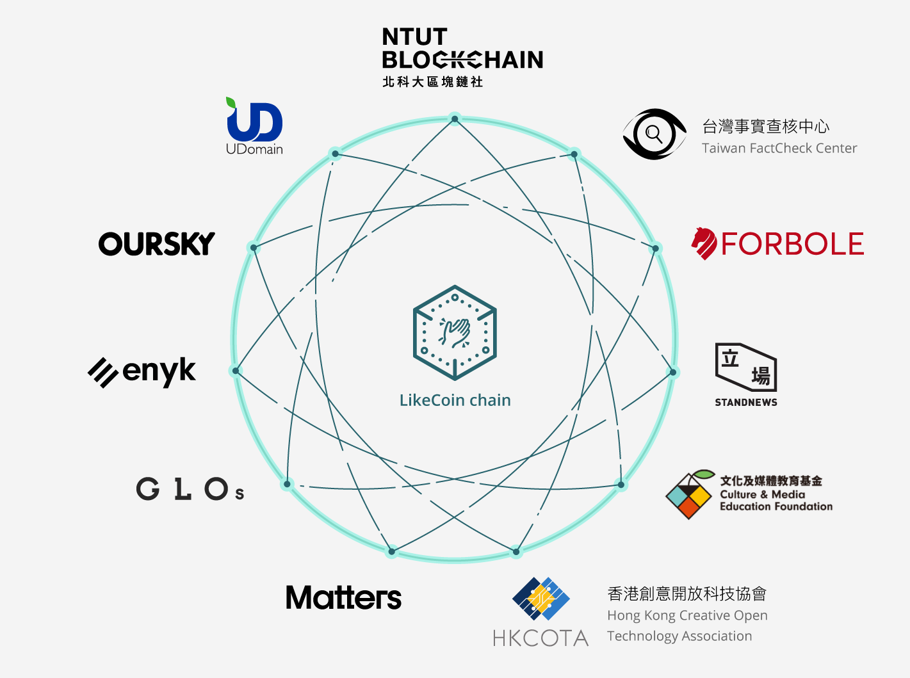
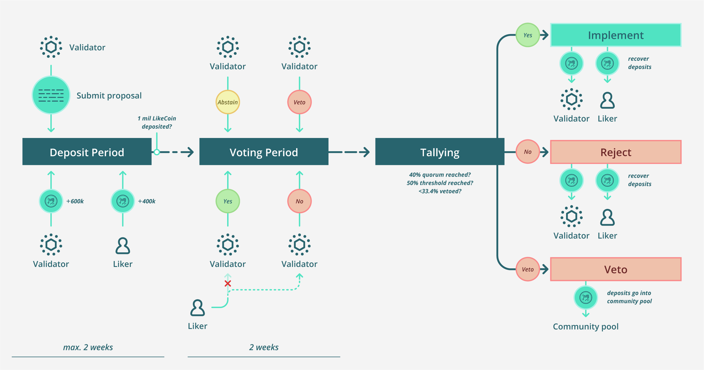

# 讚賞公民

第二次世界大戰後，歐洲 6 國於 1951 年簽署《巴黎條約》，並於翌年成立歐洲煤鋼共同體，成為歐洲歷史上第一個權限跨越國界的組織。1958 年，類似的歐洲經濟共同體和歐洲原子能共同體成立，並於 1967 年跟歐洲煤鋼共同體統合，成為歐洲各共同體。1992 年《馬城條約》簽訂並於翌年生效，歐洲各共同體成為歐洲聯盟，並漸漸從貿易實體轉變成經濟和政治聯盟。由歐洲煤鋼共同體的 6 國起，歐盟高峰時共有 28 成員國，英國脫歐後的 27 國共使用 24 種官方語言，19 國採用歐元為流通貨幣。

歐盟設有成員國首腦組成的歐洲理事會、直接民選的歐洲議會等組織，制定各項政策與法律，比如數碼單一市場版權法案（[Directive on Copyright in the Digital Single Market](https://eur-lex.europa.eu/eli/dir/2019/790/oj)）、一般資料保護規範（[General Data Protection Regulation，GDPR](https://gdpr-info.eu/)）等，再由成員國在國內立法具體執行。

歐盟各國既能保有主權、母語和文化，又能有體現共同體意志，使用單一貨幣促進貿易與加強實力，和而不同，是人類歷史上的重大里程碑。2012 年，歐盟獲頒諾貝爾和平獎。

### 公民媒體共同體

物理世界有距離有疆界，歐洲各國經歷兩次世界大戰，尚且能夠成立聯盟，貫穿各國的，是幾千年的文化底蘊與共同命運。借鑒歐盟，定位公民媒體共同體的讚賞公民共和國，Republic of Liker Land，於 2019 年 11 月 15 日正式在區塊鏈成立。

截至 2020 年 5 月，讚賞公民共和國有 1000 多個成員媒體，各自保有品牌、網站、編採方針等各項主權，只在基礎議題上謀求共識，未來議題包括定奪與處理假信息、應對內容農場、回饋好內容機制等等。共和國的共同「貨幣」為讚賞幣 LikeCoin 通證，但有別於歐元，各成員媒體同時使用各種貨幣，而以 LikeCoin 作為共同體的價值載體和投票權。

除了 1000 多個媒體成員，共和國現有公民 7 萬多，其中約 2.5% 為「讚賞公民」，每月貢獻 5 美元，化讚為賞，回饋創作，相當與共和國的繳稅人口。公民中約 14% 即 1 萬多為作者，所創作內容一般為文章，其中 24 萬多筆共得到 3 千多萬 LikeCoin 作回饋。

讚賞公民共和國成立之初，由 10 個組織組成 7 個單位充當驗證人，分別為台灣事實查核中心、國立臺北科技大學區塊鏈社、文化及媒體教育基金、香港創意開放科技協會、立場新聞、Matters、GLOs、Forbole、Oursky、Enyk 及 UDomain。驗證人的角色接近歐洲議會，但除治理外同時擔當底層 LikeCoin 區塊鏈的節點，因此部分媒體夥拍技術提供方以滿足驗證人角色。

### LikeCoin 區塊鏈

技術實現上，讚賞公民共和國以 LikeCoin 公共區塊鏈作底層，任何人無須獲得批准即可加入（permissionless），或者說，沒有人有權批准或否決媒體的加盟。LikeCoin 區塊鏈使用綁定權益證明（Bonded Proof of Stake）共識機制，由持分者把手上 LikeCoin 委託予驗證人，再由驗證人按相等於獲委託數量的投票權，確認每 5 秒鐘一個區塊的交易。

當 Alice 給 Bob 轉帳 100 LikeCoin，傳統的金融體系中記帳的是銀行，簡單的情況是同一家，複雜一點的是處於同一國家的兩家，更複雜的是分別處於兩國，相互有記帳合作的兩家，甚至更複雜的，還要再加上中轉記帳的三家銀行。相對來說，在 LikeCoin 區塊鏈中，無論兩者身在何方都一樣，Alice 以密碼學簽名發出 100 LikeCoin 後，廣播通知所有驗證人交易內容，每 5 秒鐘驗證人輪流把期間的所有交易打包成一個區塊，再由其他驗證人以密碼學簽名作實，然後 Bob 約 5 秒多後會收到 100 LikeCoin。

每簽名確認一個區塊，驗證人會按獲委託數相對總量獲得新鑄造的 LikeCoin，換言之，這些 LikeCoin 的來源是「通證膨脹」，作用是反映驗證人貢獻的價值。LikeCoin 的通脹率為每年 1%，即每年新鑄造相當於 1% 總 LikeCoin 數的通證，用以回饋驗證人。由於驗證人的投票權來自持分者委託，因此回饋由兩者分成，比例為 40-60% 不等。

LikeCoin 區塊鏈採用拜占庭容錯機制，每個區塊的確認需由 2/3 以上持分簽名作實通過，確保共同體由始至終保持共識。假設有驗證人作假修改區塊內容，不但會因為得不到 2/3 以上持分確認沒法通過，還會被處罰委託的 LikeCoin，以博弈理論防止作弊。因此，把 LikeCoin 委託予驗證人賺取回報，雖然表面上跟存款到銀行收取利息類似，但實際上是持分者貢獻資源幫助社群維持共識，故每個區塊所獲取的 LikeCoin 是補償（compensation）而非利息（interest）。熟悉比特幣的，把這個機制理解為持分挖礦，也無不可。

以上 1% 通脹率、40-60% 傭金等比率都是現有數字，可以由驗證人通過提案去增減，跟議會通過財政預算案差不多。除了經濟，媒體相關的議題如事實查核，以至軟件升級等技術決策，都可以而且需要由驗證人通過議案方可執行，這些由代碼寫成的規則，就是讚賞公民共和國的憲法，code is law，代碼就是定律。

驗證人通過議案修改各項規則，就是修憲。

### 共和國治理

讚賞公民共和國的修憲流程，第一步是由驗證人隨時提出議案。提出後，議案進入抵押期，期間提案人宣傳和集氣，務求於兩周內讓議案從持分者手中獲得一百萬 LikeCoin 抵押支持以進入投票期。議案抵押制度類似收集十萬聯署人讓議案付諸公投，抵押的 LikeCoin 則像選舉保證金，避免有人惡意提出議案，勞師動眾。

投票期為兩周，期內驗證人就議案投贊成、反對、棄權，以及比較特別的強烈反對票（veto），同一時間，持分者也可以於投票期內轉換驗證人一次。投票期結束，無論是贊成票多還是反對票多，均會發還一百萬抵押，然而，假如超過 1/3 持分投下強烈反對，表達提案為惡意，則即使贊成過半議案都不獲通過，而且抵押也將不獲發還，存於社區基金池，由後續的議案調度。

議案技術上可分三種，一是系統改版議案（upgrade proposal），用於驗證人節點軟件更新，二是參數修改議案（parameter change proposal），比如把通脹率從 1% 調高至 2%，不同於物理世界，這兩類議案通過即由代碼執行，沒有懸念。第三種是訊號議案（signaling proposal），為一種立場指引，可為共同體提供發展方向，但也牽涉執行者的進一步演繹和落實，亦有可能沒法落實，情況類似英國脫歐，即使公投結果確認，細節都久久沒法落實，甚至最終成事前一度懷疑會否爛尾。不論是否認同英國的決定，英國最終成功脫歐，再一次展示歐盟讓成員和平決定自身未來的文明，跟帝國霸權不可同日而語。

### 流動民主

以上治理方式，是流動民主的一種實踐。先撇開讚賞公民共和國語境，流動民主是代議政制的加強版，從幾方面賦予人民更深入的參與：可委託一個或以上代表，也可分不同程度；可於不同時間，就不同議題，委託不同的代表；最後，也可選擇自行就議案直接投票。

對代議政制期盼了幾十年的我們，很容易變得「夏蟲不可語冰」，難以理解更進一步的流動民主，具體如何運作。且想像在理想國，相對於一人一票，每位選民獲分配 100 點「話語權」（voice credits）。理想國居民 Alice 認可 Bob 的政見、能力與誠信，於是把 100 點話語權全數委託給 Bob。豈料，理想國政府提出議案，出賣人民，Bob 竟然投下贊成票。不幸中之大幸是，Alice 不用等待四年後以選票懲罰 Bob，而是馬上把話語權轉走，這次分散信任，分別給 Carol 與 Dave 委託 60 點和 40 點話語權。出賣人民的 Bob，由於大量話語權被轉走，即時失去議員資格。

過了一陣子，理想國表決教育改革議案，Alice 認為教師出身的 Carol 比律師 Dave 對此更有心得，遂把 Dave 的 40 點話語權都委託給 Carol，對議案投出最有力一票。又過了一陣子，理想國討論反資訊科技滲透議案，屬 Alice 的專業範疇，於是 Alice 收回 100 點話語權自用，直接對議案作出表決。話語權點數像水一般流動，讓理想國人靈活地在不同時間，就不同議題，委託不同代表議決或自行表決；至於議員，則需時刻聆聽人民訴求，確保持續反映委託者的權益。

讚賞公民共和國的流動民主，跟理想國略有區別，暫時不設個人投票的直接民主，不過由於個人可在投票期把持分轉給跟自己取向一致的驗證人，因此跟直接民主分別不大。真正顯著的差異在於，共和國以日常使用的通證 LikeCoin 同時用作話語權點數，而非使用單純用於投票的話語權點數。

去中心自治組織雖然在很多方面是物理國家在數位世界的投射，但也存在根本的不一樣，其中一個最大的區別是公民身份的落實。類似於數位內容可以無限複製，去中心自治組織內可以輕易多開身份，因此直接的一身份一票並不可行。有部分項目因此要求用戶實名認證，但這除了容易產生敏感資料外洩等一連串問題以外，也等於把原為超越者的定位拉回民族國家體制，喪失去中心自治組織最重要的意義。相對而言，讚賞公民共和國是以持份反映身份，因此單純多開沒有意義。公民媒體共同體的核心價值是報導與創作，作品所賺取的 LikeCoin，反映創作者的貢獻度，也同時反映這個身份在共和國的投票權。

讚賞公民共和國成立只有半年多，尚在初步發展，審議並通過了一個議案，把驗證人的數量從 7 個提高到 10 個，踏出了議政的第一步。共和國嘗試跳離物理世界的框架，讓公民媒體共同體在數位空間發酵，實踐民主共治，是個愚公移山似的社會實驗，單是讓大眾理解和應用可能就得十年，最終可以走得多遠，為人類社會帶來甚麼啟發，有賴公民的努力。

* 超越者
* Big Dipper: open government
* LikeCoin chain: open data
* 擁抱一套共同價值的就是 xx 

